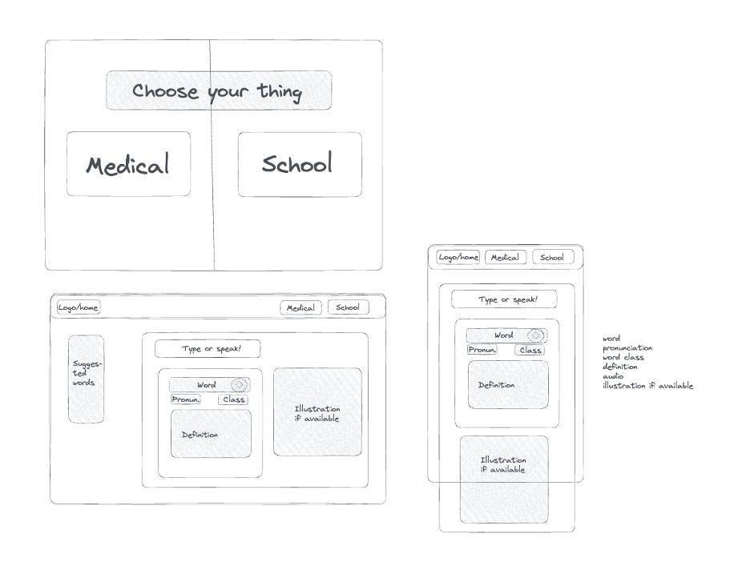
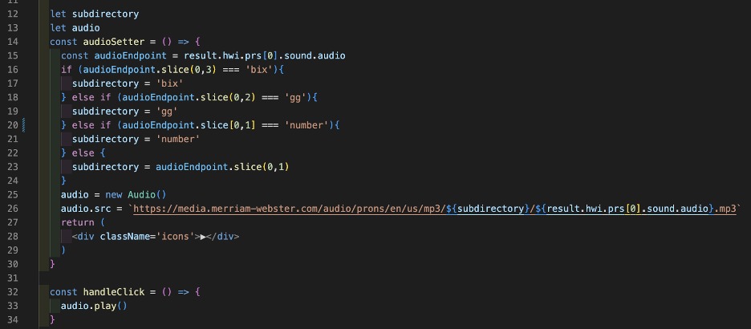
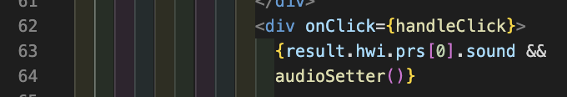
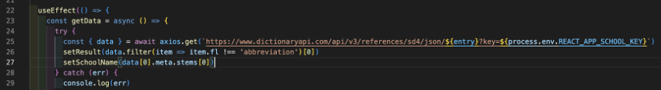
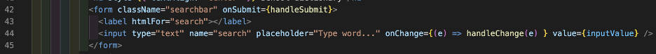
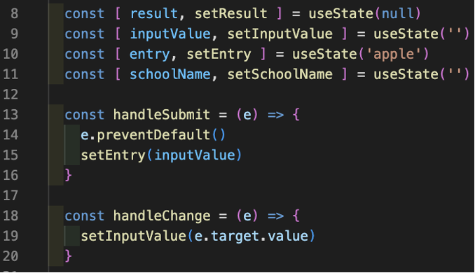
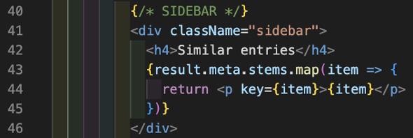

# GA Project 2 - Reactathon

# Contents
- [Description](#description)
- [Technology used](#technologies-used)
- [Project brief](#brief)
- [Planning](#planning)
- [Build process](#build-process)
- [Challenges](#challenges)
- [Wins](#wins)
- [Key learnings](#key-learnings)
- [Bugs](#bugs)
- [Future improvements](#future-improvements)

# Description

This project was a 1.5-day hackathon in a team of two to create a React project that pulls data from an API.

# Deployment link

https://msdictionaries.netlify.app/

# Getting Started/Code Installation

* Clone the app and run `npm i` to install dependencies
* Create a .env file and add REACT_APP_MEDICAL_KEY=<api_key> and REACT_APP_SCHOOL_KEY=<api_key>
* Then run the app with `npm run start`

# Timeframe & Working Team (Solo/Pair/Group)

This project was to be completed in 1.5 days in a pair with the lovely Hannah Bodey :) (https://github.com/hannahbodey/React-API-Project)

# Technologies Used

HTML, CSS, React, Merriem-Webster’s School Dictionary API, Merriam-Webster’s Medical Dictionary API, Insomnia, Sass, Excalidraw

# Brief

The second project is to build a React application that consumes a public API.
Your app must:
* Consume a public API – this could be anything but it must make sense for your project.
* Have several components.
* The app can have a router - with several "pages", this is up to you and if it makes sense for your project.
* Include wireframes - that you designed before building the app.
* Be deployed online and accessible to the public.
​

# Planning

Before beginning this project, Hannah and I brainstormed ideas for what our app could be. We wanted to make an app with translation features, whether that be a flashcard app or an English-to-foreign-language dictionary. However, with many APIs being hosted on Heroku’s free tier and that free tier no longer being available as of November 2022, most of the APIs we found were no longer usable. It took quite a bit of time to find an API that was still available, and it also meant changing our app idea slightly. We settled on using Merriam-Webster’s dictionary app to create an English reference dictionary.

We then created a wireframe for the project in Excalidraw which included both desktop and mobile design, and planned out what features the app would include. The Merriam-Webster API allows you to use endpoints for up to two dictionaries, so we decided to use both the Medical dictionary and the School dictionary. We decided that we would pull data on word, pronunciation, word class, definition, audio, and illustration if available; and the app would also feature a search bar, a sidebar of suggested words, and a separate page for each dictionary.

Then we looked at how to split tasks. We pair-coded to create the basic structure of the app including the dictionary component and page links so that we could then work separately on other parts.  
At the first delegation we agreed that Hannah would work on the navbar and medical page, and I would work on the search bar and school page, and then check in with each other.  
At the second delegation, we agreed Hannah would complete the navbar and create a landing page, and that I would style the dictionary page and pull/implement the audio and images.

# Build Process

I started by using Insomnia to make sure I had all of the endpoints and queries I would need before writing any code. I wanted to pull id, audio, definition, illustration, word, pronunciation, and word class from the API. Due to the architecture of the API, some of these had to be found with the help of the documentation - for example, word class was under a key of ‘fl’, and pronunciation had a key of ‘mw’. Similarly, when looking for illustrations and audio were very interesting to deal with - both of these had to be accessed using a formula. For example, audio had to be accessed with the following formula:
`https://media.merriam-webster.com/audio/prons/[language_code]/[country_code]/[format]/[subdirectory]/[base filename].[format]`
Using the documentation, I was able to access the correct audio reference URL with the following if statement:

With this information, I then proceeded to build up the School page with the dictionary component, which included fetching and displaying the data and making a search bar. I used a get request to retrieve data from the API inside a useEffect so that I could then set the data in state. Using async await in this way ensures that the Promise is fulfilled before painting anything to the screen, and thereby avoids having unpopulated data fields and a blank screen for the user.

For the search I simply set up a form with an onSubmit() and a handleChange() on the input. The handleChange() sets the inputted value to a state variable called ‘inputValue’, and then the onSubmit() sets that value to a state variable called ‘entry’; ‘entry’ is the value that is passed into the API call to bring data if the word matches a word in the dictionary.

I realised that having completed the School page, there wouldn’t be anything different to do on the Medical page other than displaying the illustrations, so since both pages were completed I moved on to styling them.

I then added a sidebar that displays similar words. The ‘stems’ key in the api returns an array of similar words, so I simply mapped through and displayed all of these.

We did the error handling together. 
We also separated the name call together as we realised that the endpoints for each dictionary were structured slightly differently and the query that fetched the word for School was not the correct query for the Medical.

Finally, we set up a .env file to protect our API keys when pushing to GitHub.

# Challenges

The most difficult challenge was how to handle errors when an invalid word was entered into the search bar. An invalid or unfound word would crash the whole site because it was an invalid api request. We created a fallback so that if the word is invalid, the page will display ‘word not found’. However, we noticed that sometimes this worked and other times it still crashed, which was very peculiar behaviour. Eventually we discovered that this was because the API would return a list of similar words if there were near matches, but if no near matches were found it returned undefined. We used the React Dev Tools to debug further, and discovered that whether or not the fallback failed wasn’t random - it depended on whether the API was returning a similar word or undefined. So we added further fallbacks for those scenarios, tested, and the issue was solved.

# Wins

Wins include:  
- Accessing all the data we wanted in the API, and figuring out how to access the image and audio with their different formulas
- Getting much more comfortable with how APIs can be used with state in React
- Solving the issues around unfound words
- Getting comfortable with using git flow in a team - pushing to our own branches and merging back and forth with the development branch
- Designing the app mobile-first and making it look beautiful on both mobile and desktop. 
- I’m also proud of how we communicated constantly throughout the project and worked together to solve issues :)

# Key Learnings

* Much more confident now using APIs with state. This has given me lots of ideas for more projects that I would love to make!
* Learned how valuable git is in teamwork - being able to work separately and push to different branches is fantastic for productivity.
* I learned how important it is to ensure time is managed well in a team. Tasks that may be very quick solo can take much longer than anticipated when pair-coding, and this must be accounted for in the planning stage. In hindsight the workload was split very unevenly and it was extremely exhausting having only one evening to get all of that done! However I really enjoyed this project and I am proud that we made it to the finish line with all of our goals reached :) 

<!-- Finishing an already half-completed navbar vs completing a full page including api functionality and css are not equal tasks in terms of workload, so it would have helped a lot if we thought more carefully about what tasks involved rather than looking at it as 1 task each. 
My takeaway from this is that I shouldn’t be afraid to be more assertive, and I believe this will make a huge difference in future team working situations. -->

# Bugs

I believe that we managed to squash all bugs in this project!

# Future Improvements

I would love to make the sidebar entries clickable so that the page renders the data for the clicked word. This was tricky to implement before the deadline because many of the similar words have to be accessed differently than how we were accessing the word.

I would also like to explore further visual designs for the app.

[Updates]  
Made design changes to the home page and the navbar, changed colour theme, and added Merriam-Webster logo 
